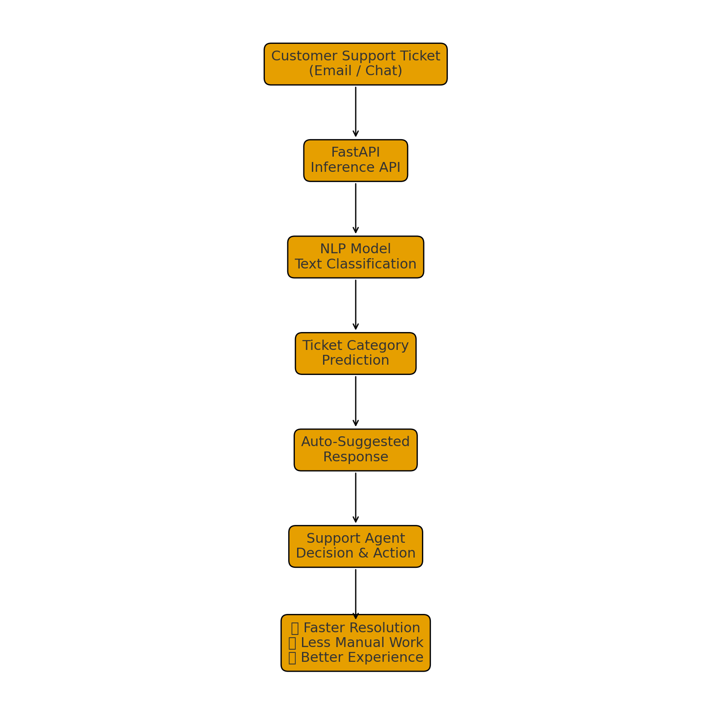
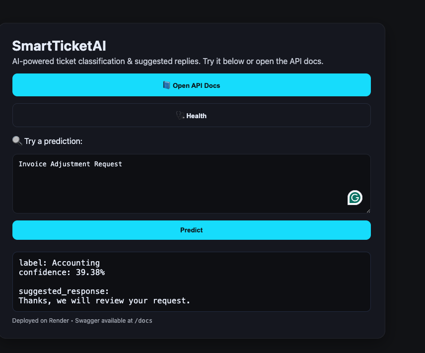

# SmartTicketAI : Automated Ticket Classification with MLOps

## Project Overview
SmartTicketAI is a  customer support automation system that classifies incoming tickets into categories such as Billing, Technical Issue, and Feature Request. It also generates a best-fit automated response and returns a prediction confidence score.

This project demonstrates a complete MLOps lifecycle including data preprocessing, model training, artifact storage, API development, CI/CD automation, containerized deployment, and live cloud hosting.

---

## Objectives
- Automate routing of customer support tickets to appropriate departments.
- Improve response speed using automated reply suggestions.
- Reduce human support workload and operational cost.
- Deploy an ML model with reliable CI/CD and scalable cloud infrastructure.

---

## Architecture

---

## System Workflow

1. User submits a support message through the frontend UI or API.
2. Request reaches the FastAPI backend endpoint (/predict).
3. The trained TF-IDF vectorizer converts text into numeric features.
4. Logistic Regression model predicts the most suitable ticket category.
5. The system calculates a confidence score for prediction.
6. A predefined automated response is selected for the predicted category.
7. The final response (label, confidence, auto-reply) is returned as JSON.
8. UI displays the result in real time.

---

## Technical Components

| Component | Technology |
|----------|------------|
| ML Model | TF-IDF + Logistic Regression (Scikit-learn) |
| API Framework | FastAPI |
| Packaging | Docker |
| CI/CD | GitHub Actions |
| Deployment | Render Cloud |
| Testing | Pytest |
| Language | Python |

---

## Data and Model Pipeline

1. Dataset loaded and cleaned (null removal, duplicate removal).
2. Exploratory Data Analysis (EDA) performed to understand label balance and text length.
3. Data split into training and testing sets.
4. TF-IDF vectorizer extracts features from ticket text.
5. Logistic Regression model trained and evaluated.
6. Artifacts saved 

---

## Project Features

- Automated ticket classification
- Confidence scoring for predictions
- Auto-response text generation
- Single and batch prediction endpoints
- Containerized deployment with Docker
- Automated build and deploy pipeline
- Live production deployment

---

## Live Demo
* Application: https://smartticketai-mlops.onrender.com  
* Swagger API Docs: https://smartticketai-mlops.onrender.com/docs

Example UI output:

---
### Real-World Usage

This project includes a demo UI where users manually enter ticket text.  
In real production environments, customers do not use such a UI.

Instead, SmartTicketAI would be automatically connected to:

- Email systems (Gmail, Outlook)
- Live chat platforms (Zendesk Chat, Freshdesk)
- Ticketing tools (Jira Service Desk, ServiceNow)

In those cases, whenever a new ticket or email arrives, the system sends the message text directly to the SmartTicketAI API for classification and automated response generation, without any manual input from the user.

